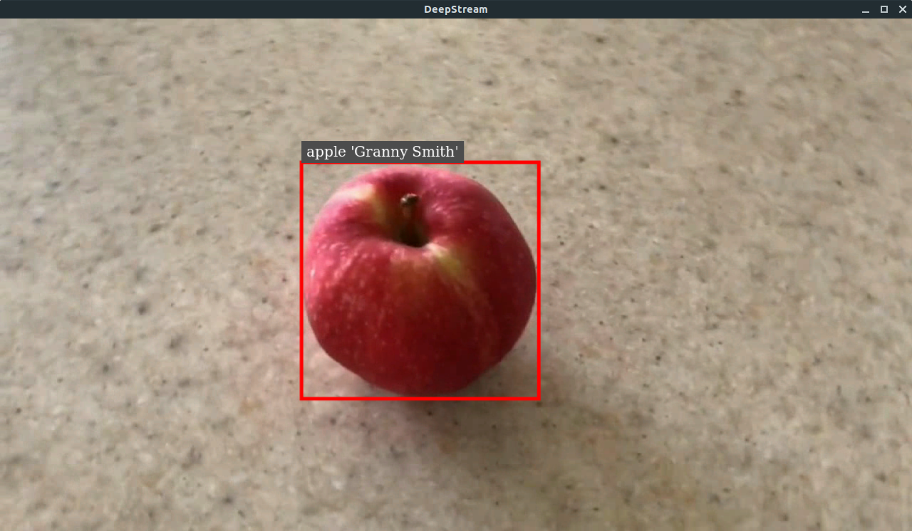
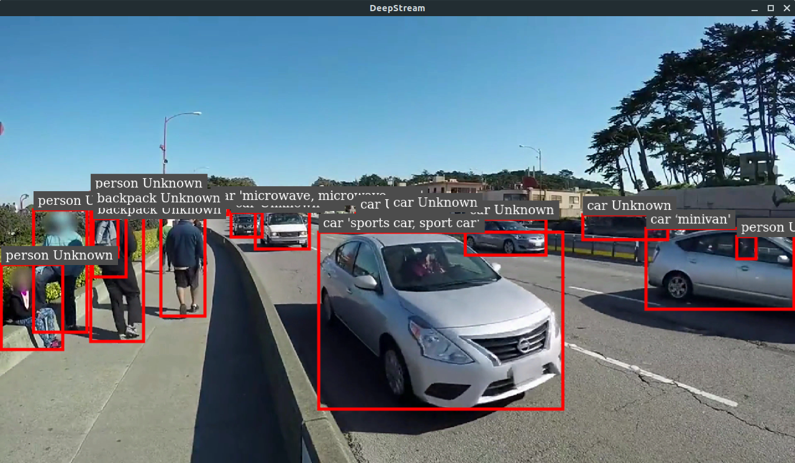

# DeepStream-Yolo Classification

## Test Environment

- Yolov5 Classification Model
- DeepStream 6.2
- x86_64

## What is this?

- This is a sample of using Yolov5 to do classification (ImageNet Pretrained) in DeepStream.

## Export ONNX Model

Use [Python script](../utils/export_yoloV5_cls.py) to export ONNX model.

## Compile the lib
    
```bash
CUDA_VER=11.8 make -C nvdsinfer_custom_impl_Yolo_cls/
```

## Run the sample

**NOTE**  
    - set ***[secondary-gie]*** `enable=1`  
    - To run apple.mp4, just change the `uri` of ***[source0]***

```bash
deepstream-app -c deepstream_app_config.txt
```

## Result 




